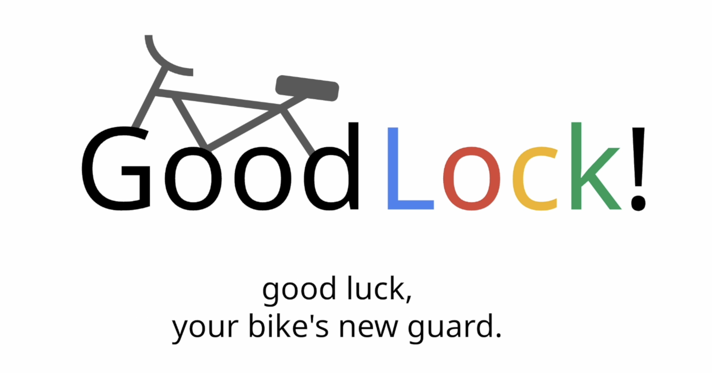

# GoodLock!
<a id="readme-top"></a>
<!-- PROJECT LOGO -->
<div align="center">
  <p align="center">
    <a href="https://youtu.be/tvExQ1x1_bo">View Demo</a>
  </p>
</div>


<!-- TABLE OF CONTENTS -->
<details>
  <summary>Table of Contents</summary>
  <ol>
    <li>
      <a href="#about-the-project">About The Project</a>
    </li>
    <li>
      <a href="#getting-started">Getting Started</a>
    </li>
  </ol>
</details>


<!-- ABOUT THE PROJECT -->
## About The Project



Introducing GoodLock :lock: – the ultimate bike lock for College students on the go! 
Tired of fumbling with keys or worrying about theft when you're racing across campus? GoodLock combines multi-mode authentication for rock-solid security, remote and contact unlock features for effortless access, and real-time GPS tracking so you can always pinpoint your ride in a sea of bicycles. Get ready to ride smarter, faster, and with total peace of mind! :bike: 

<p align="right">(<a href="#readme-top">back to top</a>)</p>


<!-- GETTING STARTED -->
## Getting Started

> 👉 Download the code  

```bash
$ git clone https://github.com/charlotteannchen/Good-Lock.git
$ cd Good-Lock
```

<br />

> 👉 Install modules via `VENV`  

```bash
$ virtualenv env
$ source env/bin/activate
$ pip install -r requirements.txt
```

<br />

> 👉 Set Up Database

```bash
$ python manage.py makemigrations
$ python manage.py migrate
```

<br />

> 👉 Create the Superuser

```bash
$ python manage.py createsuperuser
```

<br />

> 👉 Start the app

```bash
$ python manage.py runserver
```

At this point, the app runs at `http://127.0.0.1:8000/`. 

<br />
<p align="right">(<a href="#readme-top">back to top</a>)</p>


